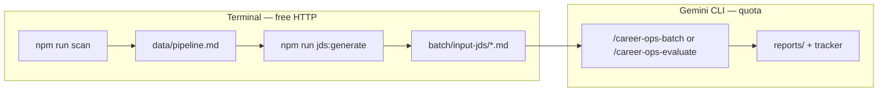

# Career-Ops — AI Job Search Pipeline (Gemini CLI)

> This file is auto-loaded by the Gemini CLI as persistent context.
> It is the Gemini equivalent of CLAUDE.md.
> All slash commands are defined in `.gemini/commands/`.

## What is career-ops

AI-powered job search automation: pipeline tracking, offer evaluation, CV generation, portal scanning, batch processing. Originally built on Claude Code, now fully supported on Gemini CLI and OpenCode.

## Data Contract (CRITICAL)

**User Layer (NEVER auto-updated — your personalizations live here):**
- `cv.md`, `config/profile.yml`, `modes/_profile.md`, `article-digest.md`, `portals.yml`
- `data/*`, `reports/*`, `output/*`, `interview-prep/*`

**System Layer (auto-updatable — do NOT put user data here):**
- `modes/_shared.md`, `modes/oferta.md`, all other modes
- `GEMINI.md`, `CLAUDE.md`, `*.mjs` scripts, `templates/*`, `batch/*`

**THE RULE:** When the user asks to customize anything (archetypes, narrative, negotiation scripts, proof points, location policy, comp targets), ALWAYS write to `modes/_profile.md` or `config/profile.yml`. NEVER edit `modes/_shared.md` for user-specific content.

## Update Check

On the first message of each session, run the update checker silently:

```bash
node update-system.mjs check
```

Parse the JSON output:
- `{"status": "update-available", ...}` → tell the user an update is available and ask if they want to apply it (`node update-system.mjs apply`)
- `{"status": "up-to-date"}` → say nothing
- `{"status": "dismissed"}` or `{"status": "offline"}` → say nothing

## Gemini CLI Commands

When using [Gemini CLI](https://github.com/google-gemini/gemini-cli), the following slash commands are available (defined in `.gemini/commands/`):

**Arguments:** Put URLs, file paths, or pasted text on the **same line** after the command (e.g. `/career-ops-evaluate batch/input-jds/role.md`). A bare `/career-ops-evaluate` leaves no job to score — the command will show usage only.

| Command | Claude Code Equivalent | Description |
|---------|------------------------|-------------|
| `/career-ops` | `/career-ops` | Show menu or evaluate JD |
| `/career-ops-model` | n/a | Set/show Gemini model for `gemini-eval.mjs` |
| `/career-ops-generate-jds` | n/a | Generate `batch/input-jds` from pending pipeline URLs |
| `/career-ops-pipeline` | `/career-ops pipeline` | Process pending URLs from inbox |
| `/career-ops-evaluate` | `/career-ops oferta` | Evaluate job offer (A-G scoring) |
| `/career-ops-compare` | `/career-ops ofertas` | Compare and rank multiple offers |
| `/career-ops-contact` | `/career-ops contacto` | LinkedIn outreach |
| `/career-ops-deep` | `/career-ops deep` | Deep company research |
| `/career-ops-pdf` | `/career-ops pdf` | Generate ATS-optimized CV |
| `/career-ops-training` | `/career-ops training` | Evaluate course/cert |
| `/career-ops-project` | `/career-ops project` | Evaluate portfolio project |
| `/career-ops-tracker` | `/career-ops tracker` | Application status overview |
| `/career-ops-apply` | `/career-ops apply` | Live application assistant |
| `/career-ops-scan` | `/career-ops scan` | Scan portals for new offers |
| `/career-ops-batch` | `/career-ops batch` | Batch processing |
| `/career-ops-patterns` | `/career-ops patterns` | Analyze rejection patterns |
| `/career-ops-followup` | `/career-ops followup` | Follow-up cadence tracker |

### Token-Safe Batch Defaults

- Batch evaluation defaults to **3 roles/files** for free-tier safety.
- To generate JD files quickly from pending URLs:
  - `npm run jds:generate` (default max 3; applies `portals.yml` title filtering like `scan.mjs`)
  - `npm run jds:generate -- --no-portals-filter` (first N URLs — higher noise)
  - `npm run jds:generate -- --max 10` (paid-tier recommended)
- Paid users can process more files by explicitly increasing limits.

**All commands share the same evaluation logic** in `modes/*.md`. The `modes/` files are shared between Claude Code, OpenCode, and Gemini CLI.

### Workflow — Gemini CLI (start here)

Think of **three buckets**:

| Bucket | What it is |
|--------|------------|
| **Inbox** | `data/pipeline.md` — lines `- [ ] URL \| Company \| Title` = jobs waiting for you |
| **JD snapshots** | `batch/input-jds/*.md` — posting text saved so Gemini does not refetch blindly |
| **Outputs** | `reports/*.md` (evaluation writeups), `data/applications.md` (tracker), optional PDFs |

**Default loop (recommended):**

1. **Fill the inbox (no LLM tokens)**  
   ```bash
   npm run scan
   ```  
   New roles append under **`## Pendientes`** in `data/pipeline.md`.

2. **See what’s waiting**  
   Open `data/pipeline.md`, or count unchecked lines:  
   `grep -c '^- \[ \]' data/pipeline.md`

3. **Turn URLs into JD files (terminal only — HTTP; uses `portals.yml` title filter)**  
   ```bash
   npm run jds:generate
   ```  
   Defaults to **3** files; paid / quota OK → `npm run jds:generate -- --max 10`.  
   Outputs land in **`batch/input-jds/`**.

4. **Score them (uses API quota)**  
   - **Inside Gemini CLI chat:** type **`/career-ops-batch`** in the input box and press Enter — **do not** run it as a Shell/bash command (there is no `/career-ops-batch` binary).  
   - **From the project terminal** (same logic as single-file `gemini-eval.mjs`):  
     ```bash
     npm run gemini:eval:batch
     npm run gemini:eval:batch -- --max 5
     ```

5. **After batch evaluations**  
   If your batch wrote tracker TSVs under `batch/tracker-additions/`, run:  
   `node merge-tracker.mjs`  
   Keep **`data/applications.md`** aligned with project rules.

**One job at a time (no batch):**

```text
/career-ops-evaluate batch/input-jds/your-file.md
```

or paste a URL / JD on the **same line** after the command.

**Quick paste (single shot):**

```text
/career-ops https://jobs.example.com/...
```

(or paste JD text after `/career-ops` — same-line arguments.)

**Optional discovery:** `/career-ops-scan` uses WebSearch-style discovery when you drive it from Gemini; **`npm run scan`** is the reliable zero-token pull from ATS APIs.



## Troubleshooting: API_KEY_INVALID (400)

If `node gemini-eval.mjs` returns:

`API key not valid. Please pass a valid API key.`

Use this checklist:

1. Open `.env` and set a real key:
   - `GEMINI_API_KEY=your_real_key_here`
   - Do not leave `your_gemini_api_key_here` (placeholder).
2. Retry:
   - `node gemini-eval.mjs --file ./jds/my-job.txt`
3. Keep auth scope clear:
   - Gemini CLI slash usage (for example `/career-ops`, `/model`) uses Gemini CLI session auth.
   - `node gemini-eval.mjs` uses `.env` (`GEMINI_API_KEY`, optional `GEMINI_MODEL`).

Model helper (script flow):

```bash
npm run gemini:model:show
npm run gemini:model -- gemini-2.0-flash
```

## First Run — Onboarding

**Before doing anything else, check if the system is set up.** Run silently every session:

1. Does `cv.md` exist?
2. Does `config/profile.yml` exist (not just profile.example.yml)?
3. Does `modes/_profile.md` exist (not just _profile.template.md)?
4. Does `portals.yml` exist (not just templates/portals.example.yml)?

If `modes/_profile.md` is missing, copy from `modes/_profile.template.md` silently.

**If ANY of these is missing, enter onboarding mode.** Guide the user step by step — ask for their CV, fill the profile, set up the tracker. See `CLAUDE.md` for the full onboarding script (identical logic applies here).

## Skill Modes

| If the user... | Mode to load |
|----------------|-------------|
| Pastes JD or URL | auto-pipeline → read `modes/_shared.md` + `modes/auto-pipeline.md` |
| Asks to evaluate offer | read `modes/_shared.md` + `modes/oferta.md` |
| Asks to compare offers | read `modes/_shared.md` + `modes/ofertas.md` |
| Wants LinkedIn outreach | read `modes/_shared.md` + `modes/contacto.md` |
| Asks for company research | read `modes/deep.md` |
| Preps for interview | read `modes/interview-prep.md` |
| Wants to generate CV/PDF | read `modes/_shared.md` + `modes/pdf.md` |
| Evaluates a course/cert | read `modes/training.md` |
| Evaluates portfolio project | read `modes/project.md` |
| Asks about application status | read `modes/tracker.md` |
| Fills out application form | read `modes/_shared.md` + `modes/apply.md` |
| Searches for new offers | read `modes/_shared.md` + `modes/scan.md` |
| Processes pending URLs | read `modes/_shared.md` + `modes/pipeline.md` |
| Batch processes offers | read `modes/_shared.md` + `modes/batch.md` |
| Asks about rejection patterns | read `modes/patterns.md` |
| Asks about follow-ups | read `modes/followup.md` |

## Main Files

| File | Function |
|------|----------|
| `data/applications.md` | Application tracker |
| `data/pipeline.md` | Inbox of pending URLs |
| `portals.yml` | Query and company config |
| `templates/cv-template.html` | HTML template for CVs |
| `generate-pdf.mjs` | Playwright: HTML to PDF |
| `article-digest.md` | Proof points from portfolio (optional) |
| `interview-prep/story-bank.md` | Accumulated STAR+R stories |
| `gemini-eval.mjs` | Standalone Gemini API evaluator (no CLI required) |

## Ethical Use — CRITICAL

- **NEVER submit an application without the user reviewing it first.** Fill forms, draft answers, generate PDFs — but always STOP before clicking Submit. The user makes the final call.
- **Strongly discourage low-fit applications.** If a score is below 4.0/5, explicitly recommend against applying.
- **Quality over speed.** A well-targeted application to 5 companies beats a generic blast to 50.

## Pipeline Integrity

1. **NEVER edit applications.md to ADD new entries** — Write TSV in `batch/tracker-additions/` and `node merge-tracker.mjs` handles the merge.
2. Run `node verify-pipeline.mjs` to check health.
3. All reports MUST include `**URL:**` and `**Legitimacy:**` in the header.
4. All statuses MUST be canonical (see `templates/states.yml`).
